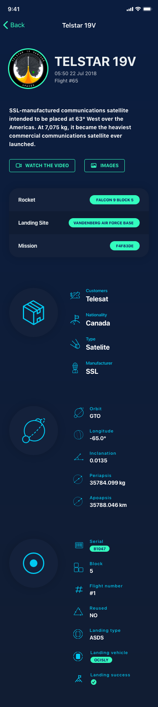
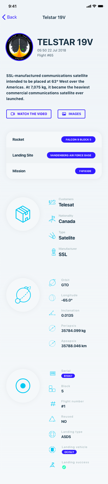

# Design Spec

## Colors

The app should use a dark theme by default, but further down the line, we should include a light theme. Below are a list of colours initially required:

- [ ] Background: Used as the main background colour, for example behind table views
- [ ] Background Alternative: Used as cell background colours
- [ ] Main Accent: Used to denote a view is actionable, or currently selected: something vibrant
- [ ] Inactive tab colour: The colour to use for inactive tabs
- [ ] Section Header Title: The colour used as section headers in table views
- [ ] Label text main: The main text colour in cells
- [ ] Label text alternative: The subtitle text colour in cells

## Views

### Launchpad

A launch pad has the following data available:

- Full name
- Details: a description of the launch pad
- Location: lat/long, which could be displayed in a map
- Location name: e.g. Cape Canaveral
- Location region: e.g. Florida
- Attempted launches
- Successful launches
- Status: active or retired
- Vehicles launched: an array of `Vehicles`

